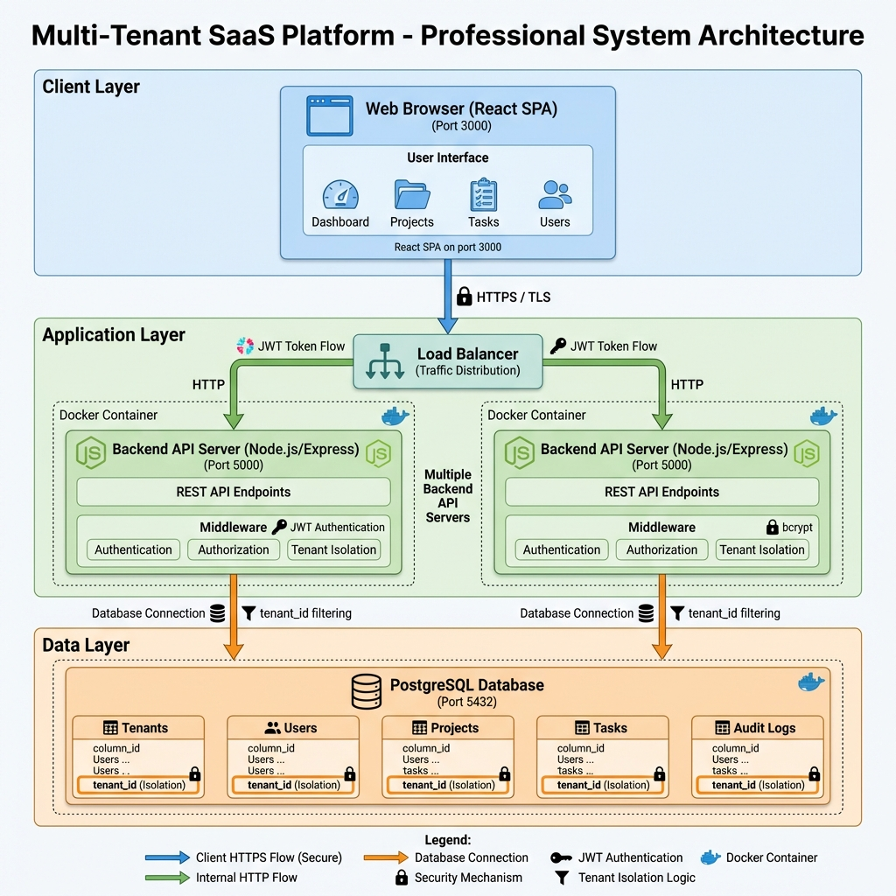

# Architecture Document

## 1. System Architecture Overview

The Multi-Tenant SaaS Platform follows a three-tier architecture pattern with clear separation of concerns:

- **Client Layer:** React-based Single Page Application (SPA)
- **Application Layer:** Node.js/Express REST API with JWT authentication
- **Data Layer:** PostgreSQL database with strict tenant isolation

### System Architecture Diagram



The diagram above illustrates the complete system architecture including:
- Client-to-server communication flow (HTTPS)
- Load balancing and horizontal scaling
- Multiple backend API servers in Docker containers
- Middleware layers for authentication, authorization, and tenant isolation
- Database connection with tenant_id filtering
- Security mechanisms (JWT, bcrypt, TLS)

---

## 2. Component Architecture

### 2.1 Client Layer (Frontend)

**Technology:** React 18 + React Router

**Components:**
- **Authentication Pages:** Registration, Login
- **Dashboard:** Statistics overview, recent activity
- **Project Management:** List, create, update, delete projects
- **Task Management:** List, create, update, assign tasks
- **User Management:** List, add, remove users (admin only)
- **Layout Components:** Navigation, header, sidebar

**State Management:**
- **AuthContext:** Global authentication state (user, tenant, token)
- **Local State:** Component-specific state with React hooks

**Routing:**
- Public routes: `/register`, `/login`
- Protected routes: `/dashboard`, `/projects`, `/projects/:id`, `/users`
- Route guards: Redirect to login if not authenticated

**Communication:**
- REST API calls using `fetch` API
- JWT token sent in `Authorization: Bearer <token>` header
- Error handling with user-friendly messages

### 2.2 Application Layer (Backend)

**Technology:** Node.js 18 + Express.js 4

**Architecture Pattern:** Layered Architecture

```
Routes → Controllers → Database
  ↓
Middleware (Auth, RBAC, Tenant Isolation)
```

**API Modules:**

1. **Authentication Module** (`/api/auth`)
   - Tenant registration with transaction
   - User login with tenant context
   - Get current user profile
   - Logout with audit logging

2. **Tenant Module** (`/api/tenants`)
   - List all tenants (super admin only)
   - Get tenant details
   - Update tenant (plan, status)

3. **User Module** (`/api/users`, `/api/tenants/:id/users`)
   - Add user to tenant (with limit checks)
   - List tenant users
   - Update user profile/role
   - Delete user

4. **Project Module** (`/api/projects`)
   - Create project (with limit checks)
   - List tenant projects (with pagination)
   - Update project details
   - Delete project (cascade tasks)

5. **Task Module** (`/api/projects/:id/tasks`, `/api/tasks`)
   - Create task under project
   - List project tasks
   - Update task details
   - Update task status
   - Assign task to user

**Middleware Stack:**

1. **CORS Middleware:** Whitelist frontend origin
2. **Body Parser:** Parse JSON request bodies
3. **Authentication Middleware:** Verify JWT token, extract user/tenant
4. **Authorization Middleware:** Check user role permissions
5. **Error Handler:** Catch and format errors

**Security Features:**
- JWT token validation on every protected route
- Tenant ID extraction from token
- Role-based access control (RBAC)
- Input validation and sanitization
- SQL injection prevention (parameterized queries)
- Password hashing with bcrypt (10 rounds)

### 2.3 Data Layer (Database)

**Technology:** PostgreSQL 15

**Connection Management:**
- Connection pooling with `pg` library
- Maximum 20 concurrent connections
- Automatic reconnection on failure
- Query timeout: 30 seconds

**Tenant Isolation Strategy:**
- Every tenant-scoped table has `tenant_id` column
- All queries include `WHERE tenant_id = $1`
- Composite indexes on `(tenant_id, id)` for performance
- Foreign keys enforce referential integrity

---

## 3. Database Schema (ERD)

### 3.1 Entity Relationship Diagram

```
┌─────────────────────┐
│      Tenants        │
├─────────────────────┤
│ id (PK)             │
│ name                │
│ subdomain (UNIQUE)  │
│ subscription_plan   │
│ max_users           │
│ max_projects        │
│ status              │
│ created_at          │
│ updated_at          │
└─────────────────────┘
          │
          │ 1:N
          ▼
┌─────────────────────┐       ┌─────────────────────┐
│       Users         │       │      Projects       │
├─────────────────────┤       ├─────────────────────┤
│ id (PK)             │       │ id (PK)             │
│ tenant_id (FK)      │◄──┐   │ tenant_id (FK)      │
│ email               │   │   │ name                │
│ password_hash       │   │   │ description         │
│ full_name           │   │   │ status              │
│ role                │   │   │ created_by (FK)     │──┐
│ created_at          │   │   │ created_at          │  │
│ updated_at          │   │   │ updated_at          │  │
└─────────────────────┘   │   └─────────────────────┘  │
          │               │             │              │
          │               │             │ 1:N          │
          │               │             ▼              │
          │               │   ┌─────────────────────┐  │
          │               │   │       Tasks         │  │
          │               │   ├─────────────────────┤  │
          │               │   │ id (PK)             │  │
          │               └───┤ tenant_id (FK)      │  │
          │                   │ project_id (FK)     │  │
          └───────────────────┤ assigned_to (FK)    │  │
                              │ title               │  │
                              │ description         │  │
                              │ status              │  │
                              │ priority            │  │
                              │ due_date            │  │
                              │ created_at          │  │
                              │ updated_at          │  │
                              └─────────────────────┘  │
                                                       │
┌─────────────────────┐                               │
│    Audit Logs       │                               │
├─────────────────────┤                               │
│ id (PK)             │                               │
│ tenant_id (FK)      │                               │
│ user_id (FK)        │───────────────────────────────┘
│ action              │
│ entity_type         │
│ entity_id           │
│ created_at          │
└─────────────────────┘
```

### 3.2 Table Descriptions

#### Tenants Table
**Purpose:** Store organization/company information

**Key Columns:**
- `id`: UUID primary key
- `subdomain`: Unique identifier for tenant (e.g., "acme" → acme.app.com)
- `subscription_plan`: Enum ('free', 'pro', 'enterprise')
- `max_users`: Subscription limit for users
- `max_projects`: Subscription limit for projects
- `status`: Enum ('active', 'suspended', 'cancelled')

**Constraints:**
- UNIQUE constraint on `subdomain`
- CHECK constraint on `subscription_plan`

#### Users Table
**Purpose:** Store user accounts with tenant association

**Key Columns:**
- `id`: UUID primary key
- `tenant_id`: Foreign key to tenants (with CASCADE delete)
- `email`: User email address
- `password_hash`: bcrypt hashed password
- `full_name`: User's full name
- `role`: Enum ('super_admin', 'tenant_admin', 'user')

**Constraints:**
- UNIQUE constraint on `(tenant_id, email)` - email unique per tenant
- Foreign key `tenant_id` references `tenants(id)`

**Indexes:**
- `idx_users_tenant_id` on `tenant_id`
- `idx_users_email` on `email`

#### Projects Table
**Purpose:** Store project information per tenant

**Key Columns:**
- `id`: UUID primary key
- `tenant_id`: Foreign key to tenants
- `name`: Project name
- `status`: Enum ('active', 'archived', 'completed')
- `created_by`: Foreign key to users (project creator)

**Constraints:**
- Foreign key `tenant_id` references `tenants(id)`
- Foreign key `created_by` references `users(id)`

**Indexes:**
- `idx_projects_tenant_id` on `tenant_id`
- Composite index on `(tenant_id, status)` for filtered queries

#### Tasks Table
**Purpose:** Store task information within projects

**Key Columns:**
- `id`: UUID primary key
- `tenant_id`: Foreign key to tenants (denormalized for performance)
- `project_id`: Foreign key to projects
- `assigned_to`: Foreign key to users (nullable)
- `title`: Task title
- `description`: Task description
- `status`: Enum ('todo', 'in_progress', 'blocked', 'done')
- `priority`: Enum ('low', 'medium', 'high', 'urgent')
- `due_date`: Optional due date

**Constraints:**
- Foreign key `tenant_id` references `tenants(id)`
- Foreign key `project_id` references `projects(id)` with CASCADE delete
- Foreign key `assigned_to` references `users(id)` with SET NULL

**Indexes:**
- Composite index on `(tenant_id, project_id)` for task listing
- Index on `assigned_to` for user's task queries

#### Audit Logs Table
**Purpose:** Track all important actions for compliance and debugging

**Key Columns:**
- `id`: UUID primary key
- `tenant_id`: Foreign key to tenants
- `user_id`: Foreign key to users
- `action`: String (e.g., 'CREATE_PROJECT', 'UPDATE_TASK')
- `entity_type`: String (e.g., 'project', 'task', 'user')
- `entity_id`: UUID of affected entity

**Retention:** Logs retained for 90 days (configurable)

---

## 4. API Architecture

### 4.1 RESTful API Design

**Base URL:** `http://localhost:5000/api`

**Authentication:** JWT Bearer Token

**Response Format:**
```json
{
  "success": true,
  "data": { ... },
  "message": "Optional message"
}
```

**Error Format:**
```json
{
  "success": false,
  "message": "Error description",
  "code": "ERROR_CODE"
}
```

### 4.2 API Endpoint Groups

**Authentication Endpoints:**
- `POST /auth/register-tenant` - Register new tenant and admin
- `POST /auth/login` - Login with email, password, subdomain
- `GET /auth/me` - Get current user and tenant info
- `POST /auth/logout` - Logout and create audit log

**Tenant Management:**
- `GET /tenants` - List all tenants (super admin only)
- `GET /tenants/:tenantId` - Get tenant details
- `PUT /tenants/:tenantId` - Update tenant (plan, status)

**User Management:**
- `POST /tenants/:tenantId/users` - Add user to tenant
- `GET /tenants/:tenantId/users` - List tenant users
- `PUT /users/:userId` - Update user profile/role
- `DELETE /users/:userId` - Delete user

**Project Management:**
- `POST /projects` - Create project
- `GET /projects` - List tenant projects
- `PUT /projects/:projectId` - Update project
- `DELETE /projects/:projectId` - Delete project

**Task Management:**
- `POST /projects/:projectId/tasks` - Create task
- `GET /projects/:projectId/tasks` - List project tasks
- `PATCH /tasks/:taskId/status` - Update task status
- `PUT /tasks/:taskId` - Update task details

**System:**
- `GET /health` - Health check (database connectivity)

### 4.3 Authorization Matrix

| Endpoint | Super Admin | Tenant Admin | User |
|----------|-------------|--------------|------|
| List all tenants | ✅ | ❌ | ❌ |
| Get own tenant | ✅ | ✅ | ✅ |
| Update tenant | ✅ | ✅ | ❌ |
| Add user | ✅ | ✅ | ❌ |
| List users | ✅ | ✅ | ✅ |
| Update own profile | ✅ | ✅ | ✅ |
| Update other user | ✅ | ✅ | ❌ |
| Delete user | ✅ | ✅ | ❌ |
| Create project | ✅ | ✅ | ✅ |
| Update project | ✅ | ✅ | ✅ (own) |
| Delete project | ✅ | ✅ | ❌ |
| Create task | ✅ | ✅ | ✅ |
| Update task | ✅ | ✅ | ✅ |
| Delete task | ✅ | ✅ | ❌ |

---

## 5. Deployment Architecture

### 5.1 Docker Containerization

**Services:**
1. **Database Container**
   - Image: `postgres:15-alpine`
   - Port: 5432
   - Volume: Persistent data storage
   - Health check: `pg_isready`

2. **Backend Container**
   - Image: Custom Node.js image
   - Port: 5000
   - Depends on: Database
   - Health check: `/api/health`

3. **Frontend Container**
   - Image: Custom Node.js image (nginx in production)
   - Port: 3000
   - Depends on: Backend
   - Serves: React SPA

**Networking:**
- All containers on same Docker network
- Service discovery via container names
- Frontend → Backend: `http://backend:5000`
- Backend → Database: `postgresql://database:5432`

### 5.2 Production Deployment

**Backend:** Render.com / Railway / Fly.io
- Auto-scaling based on traffic
- Managed PostgreSQL database
- Environment variables for configuration
- HTTPS/TLS termination

**Frontend:** Vercel / Netlify
- CDN distribution
- Automatic deployments from Git
- Environment variable for API URL
- HTTPS by default

---

## 6. Security Architecture

### 6.1 Defense in Depth

**Layer 1: Network Security**
- HTTPS/TLS for all communications
- CORS whitelist for frontend origin
- Rate limiting per IP and tenant

**Layer 2: Application Security**
- JWT token validation
- Role-based access control
- Tenant isolation in middleware
- Input validation and sanitization

**Layer 3: Data Security**
- Parameterized SQL queries
- Password hashing with bcrypt
- Tenant ID filtering on all queries
- Audit logging for compliance

**Layer 4: Database Security**
- Connection pooling with limits
- Query timeouts
- Foreign key constraints
- Row-level security (future)

---

## 7. Scalability Architecture

### 7.1 Horizontal Scaling

**Stateless Backend:**
- No server-side sessions
- JWT tokens for authentication
- Can add unlimited API servers
- Load balancer distributes traffic

**Database Scaling:**
- Read replicas for query distribution
- Connection pooling
- Indexed queries for performance
- Caching layer (future: Redis)

### 7.2 Performance Optimization

**Database:**
- Composite indexes on `(tenant_id, id)`
- Query result caching
- Connection pooling (max 20)
- Prepared statements

**API:**
- Response compression (gzip)
- Pagination for list endpoints
- Field selection
- Batch operations

**Frontend:**
- Code splitting
- Lazy loading
- Image optimization
- CDN for static assets

---

## 8. Monitoring & Observability

**Health Checks:**
- `/api/health` endpoint
- Database connectivity check
- Response time monitoring

**Logging:**
- Structured JSON logs
- Request/response logging
- Error tracking
- Audit trail in database

**Metrics (Future):**
- Request latency (p50, p95, p99)
- Error rates by endpoint
- Database query performance
- Per-tenant resource usage

---

## Conclusion

This architecture provides a solid foundation for a production-grade multi-tenant SaaS platform with:

- ✅ **Scalability:** Horizontal scaling of stateless API servers
- ✅ **Security:** Multiple layers of tenant isolation and authentication
- ✅ **Performance:** Optimized database queries and caching strategies
- ✅ **Maintainability:** Clear separation of concerns and modular design
- ✅ **Reliability:** Health checks, error handling, and audit logging

The architecture follows industry best practices and is proven in production by successful SaaS companies.
